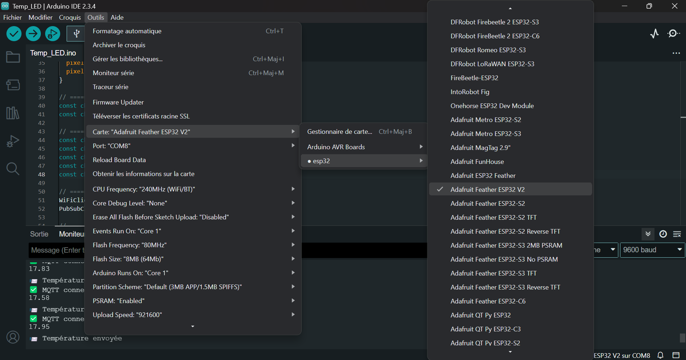

# Guide de dépannage

---
## *Sommaire*

- Introduction : [Voir](#Introduction)
- Programme Arduino : [Voir](#Programme-Arduino)

## *Introduction*

Dans ce fichier nous allons répertorier les problèmes majeurs que l'on a rencontré et que s'il resurvienne savoir comment les régler.

---

## Programme Arduino

Il a beaucoup de paramètre à configurer et si il sont mal fait, ils peuvent tout fausser.

1. Choix de la carte

Il faut donc choisir la carte nommées `Adafruit Feather ESP32 V2` et non ~~ESP32 Dev Module~~

 

2. Choix du Wifi

Il faut choisir un wifi en 2,4 GHz pour la connexion à la carte ESP32, le téléphone marche très bien, il peut souvent faire 2,4 GHz et 5 GHz.

Il ne faut pas d'espace entre le texte et les "" dans le programme Arduino `"Texte"` et non ~~" Texte "~~ sinon cela change totalement le nom du wifi qu'il cherche. Et pareil avec le mot de passe.

 

3. Alimentation du capteur

Si on veut des valeurs stables, il faut que le capteur soit alimenté en 5 V au moins mais pas 3,3 V. 

Donc on se place sur la broche nommé `USB` de la carte EP32