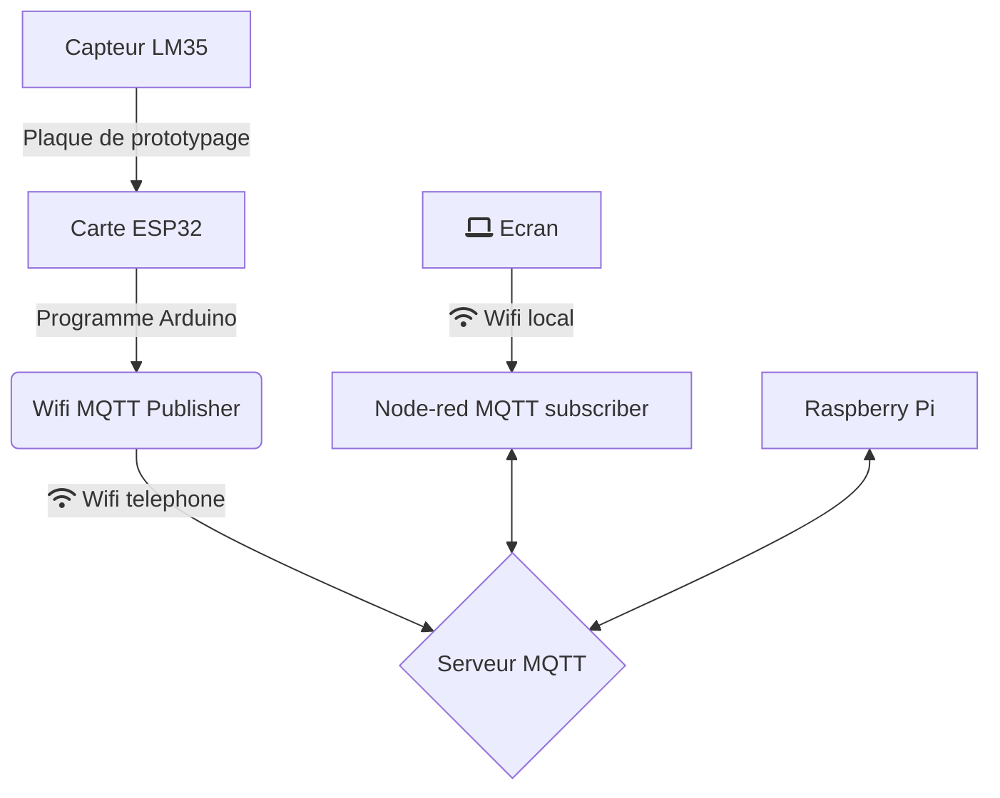
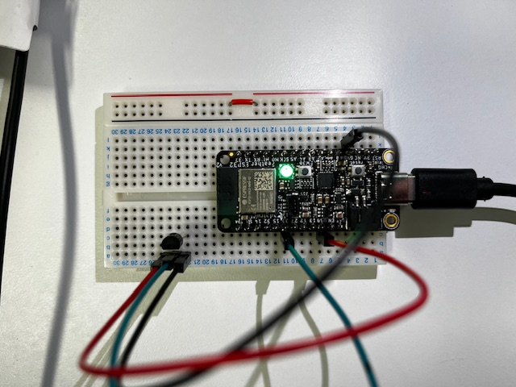
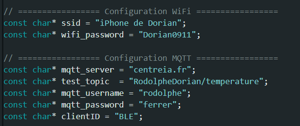
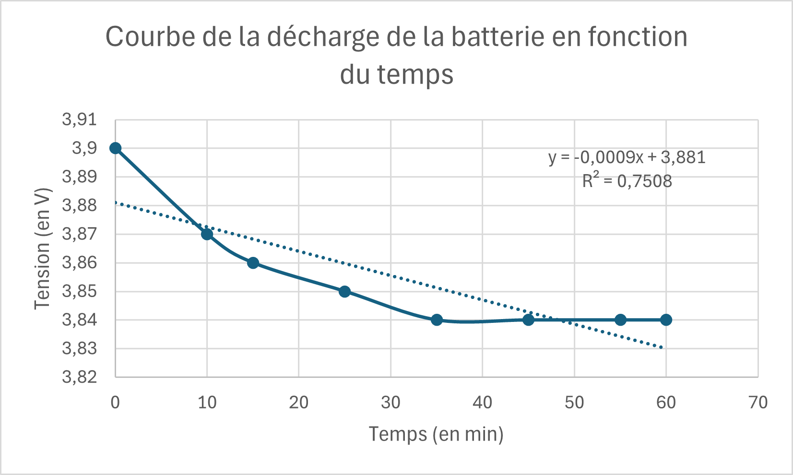
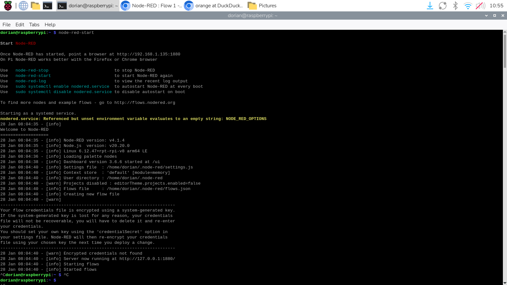
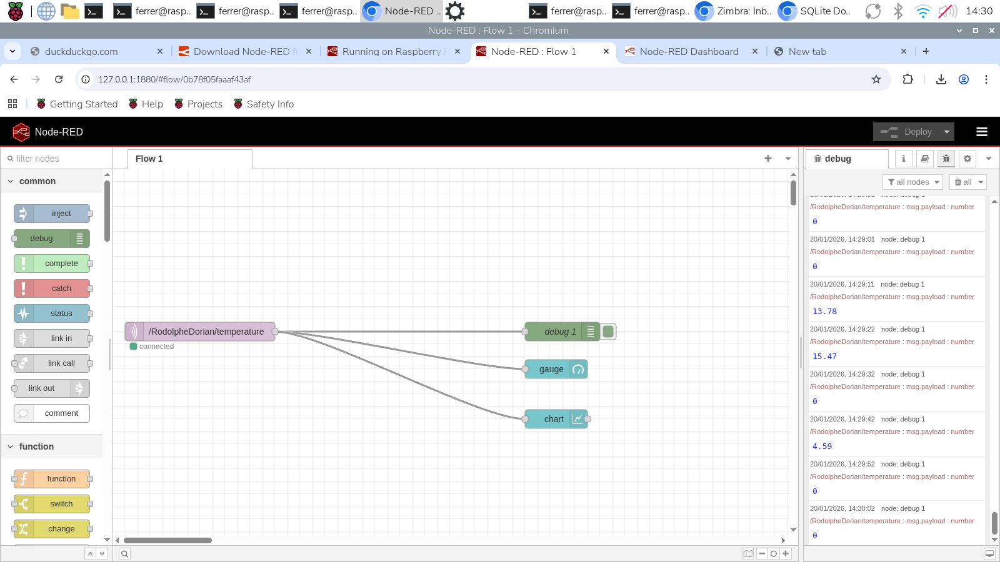
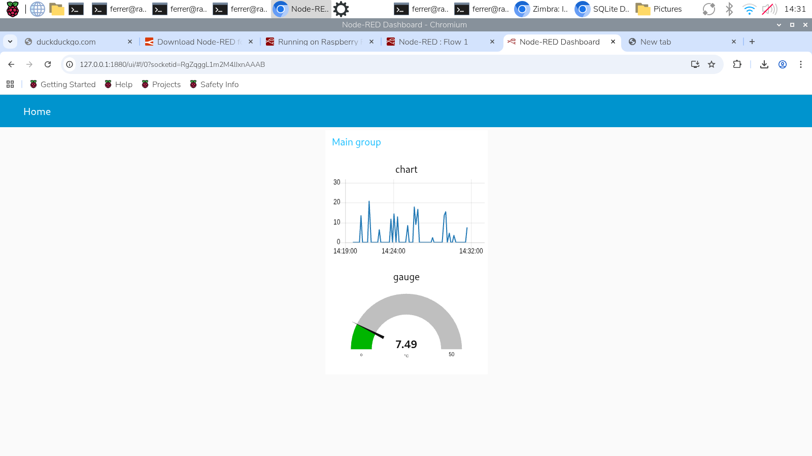
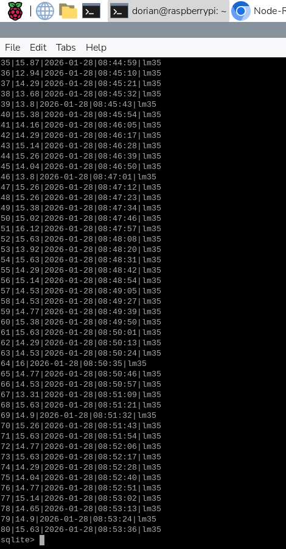
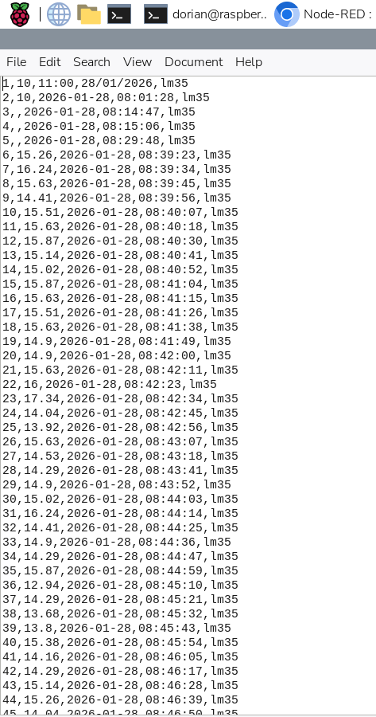
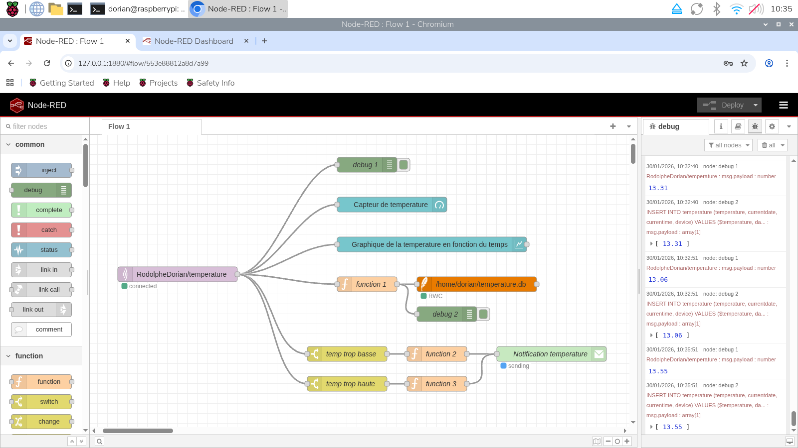

# Rapport Projet LM35

---
## *Sommaire*

- Introduction : [Voir](#Introduction)
- Acquisition et Transmission des données : [Voir](#Acquisition-et-Transmission-des-données)
- Affichage et Interface Utilisateur : [Voir](#Affichage-et-Interface-Utilisateur)
- Stockage et Exploitation des Données : [Voir](#Stockage-et-Exploitation-des-Données)
- Amélioration affichage et Interface Utilisateur : [Voir](#Amélioration-affichage-et-Interface-Utilisateur)
- Alertes et Automatisation : [Voir](#Alertes-et-Automatisation)
- Sécurisation et Fiabilité : [Voir](#Sécurisation-et-Fiabilité)
- Annexe : [Voir](#Annexe)

## *Introduction*

L'objectif de ce projet est de concevoir un système de surveillance de température en utilisant un capteur LM35, une carte ESP-32, une Raspberry Pi et le protocole MQTT.

Les données seront transmises au Raspberry Pi via Mosquitto, stockées dans une base de données SQLite, et affichées en temps réel via NodeRED. On devra également mettre en place des alertes et documenter votre travail. Ci-dessous un diagramme mermaid montrant le chemin de transmission des données :




## *Acquisition et Transmission des données*

Dans cette partie nous allons aborder comment nous avons récupérés et affichés les données du capteur sur un écran via MQTT
Tout d'abord on vient connecter la carte ESP32 au capteur LM35 avec alimentation en 5 V `Pin USB` et sortie analogique 33, comme ci-dessous:

<p align="center"> </p>
<p align="center"><em>Figure 1 : Branchement entre la carte ESP32 et le capteur LM35</em></p>

Par la suite on intègre le programme Arduino ([Voir en annexe](#Annexe)) dans la carte ESP-32 afin de récupérer les valeurs du capteurs en mV et les convertir en degrés puis on vient publier les données dans un topic ici (RodolpheDorian/temperature) avec une connection Wifi que l'on renseigne dans le programme.

<ins>Conversion des mV en degrés : </ins>

``` bash
  int raw = analogRead(33);
  float volts = (float)raw * 5 / 4095;
  float degres = volts / 0.01;
```

>[!IMPORTANT]
>La connexion Wifi doit être en 2,4 GHz au risque que les données ne puissent pas s'envoyer, à noter que ce n'est pas primordial que le Wifi sur Arduino soit le même que celi sur la Raspberry Pi

<p align="center"> </p>
<p align="center"><em>Figure 2 : Programme Arduino</em></p>

> [!TIP]
> Pour réduire la consommation électrique du module on vient augmenter le délais de transmission des données, ici on les transmets toutes les dix secondes.

Pour vérifier que le module consommé peu, nous avons branché une batterie de 3,9 V sur la carte ESP32 et pendant 1h on a relevé les valeurs de tension de la batterie, puis on a tracè la courbe de la décharge en V en fonction du temps (voir ci-dessous)

<p align="center"> </p>
<p align="center"><em>Figure 3 : Courbe de déchargement de la batterie</em></p>

On observe donc une courbe décroissante, pas totalement linéaire ce qui est normale pour une courbe de décharge de batterie selon la théorie, avec pour équation $`U = -0{,}0009t + 3{,}881`$ , ce qui signifie que la batterie se décharge de 0,9 mV toutes les minutes

<p align="center"> </p>
<p align="center"><em>Figure 4 : Montage déchargement de la batterie</em></p>


## *Affichage et Interface Utilisateur*

Dans cette partie on vient créer grâce à Node-Red une interface qui montre l'évolution en temps réel de la température mesuré avec le capteur LM35 

Sur la Raspberry Pi, on vient tout d'abord installé Node-red à partir de cette commande :
```bash
bash <(curl -sL https://github.com/node-red/linux-installers/releases/latest/download/update-nodejs-and-nodered-deb)
```
Puis on exécute cette commande dans le terminal de la Raspberry Pi et on vient faire un "contrôle + clic" sur l'adresse IP, ce qui ouvre directement une page Node-red dans le moteur de recherche.
```bash
node-red-start 
```
<p align="center"> </p>
<p align="center"><em>Figure 5 : Accès Node-red</em></p>

Dans la page Node-red on renseigne le nom de domaine (centreia.fr) et le nom du topic (RodolpheDorian/temperature), on vient ajouter une jauge et un graphique permettant de visualiser les données dans une interface :

<p align="center"> </p>
<p align="center"><em>Figure 5 : Interface Node-red</em></p>

Après avoir déployé le programme dans Node-red on exécute dans un nouvel onglet ce lien : 
```bash
http://<hostname>:1880/ui # Avec hostname l'IP de notre interface Node-red ici 127.0.0.1
```
On obtient alors cette interface :

<p align="center"> </p>
<p align="center"><em>Figure 6 : Jauge et Graphique</em></p>

## *Stockage et Exploitation des Données*

Dans cette partie, nous allons dans un premier temps enregistrer les données dans une base SQlite sur la Raspberry Pi. Puis dans un second temps, mettre en place une structure de base de données organisée afin d’assurer une récupération efficace des données.
 
Pour ce faire, nous commençons par allumer la Raspberry Pi et l'on s’assure qu'elle est bien connectée à un réseau WIFI avec un accès à Internet.

> [!NOTE]
> Dans cette partie on reprends le travail fait dans la partie **Affichage et interface utilisateur** avec l'installions de Node-Red et son démarage.
- Affichage et Interface Utilisateur : [Voir](#Affichage-et-Interface-Utilisateur)

Une fois que Node-Red est installé et lancé, on passe à la création de la base de données SQLite :

1. Installation SQLite

```bash
sudo apt install sqlite3
```

2. Création de la base de données
```bash
sqlite3 temperature.db
```

3. Création tableau de données

Cela permet de visualiser les données sur la console du Raspberry. On utilise la ligne de code suivante pour sa création :

```bash
CREATE TABLE temperature ( id INTEGER PRIMARY KEY AUTOINCREMENT, temperature, currentdate, currentime, device) ;
```
On a donc créer 5 colonnes qui vont contenir le nombre d'itération | la valeur de la température à l'instant t | la date actuelle | le temps t de la mesure | l'objet, ici le capteur LM35

4. Insertion des données dans le tableau

Au dèpart le tableau est vide, il faut donc le remplir et dire où le programme doit chercher les valeurs pour chaque colonnes. On exécute donc cette commande :

```bash
INSERT INTO temperature (temperature, currentime, currentdate, device) VALUES ($temperature, time(« now »), date (« now »), « lm35 ») ;
```
Si la carte ESP32 est correctement connectée au serveur MQTT de la Raspberry Pi alors le tableau se remplit au fur et à mesure que les données sont envoyées.

5. Visualiser les données

Pour pouvoir visualiser les données dans le terminal du Raspberry, on utilise cette commande :

```bash
SELECT * from temperature
```
On obtient le tableau suivant :

<p align="center"> </p>
<p align="center"><em>Figure 6 : Base de données SQlite</em></p>

6. Création d'un fichier CSV

On peut ensuite crée un fichier CSV permettant de stocker les données afin de les retrouver et les exploiter plus tard.
Il faut donc exécuter dans l'ordre ces commandes :

```bash
.mode csv
.output data.csv #le fichier ce nomme data ici
SELECT * from temperature;
```
Ce fichier « data.csv » est enregistrer dans /home/dorian, dans la carte SD de la Raspberry.

<p align="center">
  
  
</p><p align="center"><em>Figure 6 : Chemin d'accès CSV</em></p>

## *Amélioration affichage et Interface Utilisateur*

On vient reprendre la base que l'on avait dans la partie [Affichage et interface Utilisateur](#Affichage-et-Interface-Utilisateur) pour l'améliorer.
Notre schéma est composé de 7 blocs principaux :
- 1 bloc de connexion
- 1 bloc jauge de température
- 1 bloc fonction
- 2 bloc de debug
- 1 bloc SQLite
- 1 bloc graphique

<p align="center"> </p>
<p align="center"><em>Figure 6 : Interface Node-Red</em></p>


## *Alertes et Automatisation*

Dans cette partie on veut créer un système d'alerte par LED et également par envoie de notification (mail/message Discord) qui prévient lorsque la température dépasse un certain seuil.

Regardons d'abord la **configuration de la LED**

Ensuite dans Arduino, on télécharge dans le gestionnaire de bibliothèque la librairie : Adafruit DMA neopixel Library, puis on téléverse le script `BlinkRGB` dans Fichier --> Exemple --> ESP32 --> GPIO --> BlinkRGB

``` bash
void setup() {
  // No need to initialize the RGB LED
}

// the loop function runs over and over again forever
void loop() {
#ifdef RGB_BUILTIN
  digitalWrite(RGB_BUILTIN, HIGH);  // Turn the RGB LED white
  delay(1000);
  digitalWrite(RGB_BUILTIN, LOW);  // Turn the RGB LED off
  delay(1000);

  rgbLedWrite(RGB_BUILTIN, RGB_BRIGHTNESS, 0, 0);  // Red
  delay(1000);
  rgbLedWrite(RGB_BUILTIN, 0, RGB_BRIGHTNESS, 0);  // Green
  delay(1000);
  rgbLedWrite(RGB_BUILTIN, 0, 0, RGB_BRIGHTNESS);  // Blue
  delay(1000);
  rgbLedWrite(RGB_BUILTIN, 0, 0, 0);  // Off / black
  delay(1000);
#endif
}
```
> [!NOTE]
> Normalement on observe la LED qui s'allume en rouge-->vert-->bleu et s'éteint pendant une durée de 1s chacun.

Une fois que ce programme fonctionne on l'ajoute au programme Arduino de base qui envoie les données vers le MQTT, on peut retrouver le programme en annexe [Voir](#Annexe)

Le programme à toute une série de code couleur qui idique l'état de la transmission des données que je vais lister ci-dessous : 
- 🟢 --> Envoie d'une température inférieur à 20°C
- 🔴 --> Envoie d'une température supérieur à 20°C
- 🟠 --> Echec de la connexion au MQTT & Erreur envoie MQTT
- 🟡 --> Tentative de connexion au Wifi
- 🔵 --> Démarage du programme Arduino (Void setup())

## *Sécurisation et Fiabilité*

Afin d’évaluer la résilience du système face à une interruption du réseau et de vérifier la continuité de la transmission des données, plusieurs scénarios de coupure ont été simulés.
Dans un premier temps, la carte ESP32 ainsi que le Raspberry Pi ont été déconnectés du réseau, puis reconnectés volontairement. Après rétablissement de la connexion, nous avons constaté que la transmission des données via le protocole MQTT reprenait automatiquement, sans perte fonctionnelle ni intervention manuelle.

Un second test a consisté à modifier le réseau Wi-Fi utilisé par les équipements, puis à les reconnecter au nouveau point d’accès. Les résultats observés ont confirmé le même comportement : les données étaient de nouveau transmises correctement vers le broker Mosquitto, stockées dans la base de données SQLite et affichées en temps réel sur Node-RED.

Ces tests démontrent la capacité du système à gérer des interruptions réseau temporaires tout en assurant la reprise automatique des communications.

---
<p align="center"> [Voir le Guide de dépanage⚙️](#Guide_de_dépannage.md)</p>
---

## *Annexe*

<p align="center"><ins>Programme Arduino téléverser sur la carte ESP32</ins></p>

``` bash
#include <WiFi.h>
#include <PubSubClient.h>
#include <Adafruit_NeoPixel.h>

// ================= LED NEOPIXEL (Feather V2) =================
Adafruit_NeoPixel pixel(1, PIN_NEOPIXEL, NEO_GRB + NEO_KHZ800);

// ----- Fonctions couleurs -----
void ledRouge() {
  pixel.setPixelColor(0, pixel.Color(255, 0, 0));
  pixel.show();
}

void ledVerte() {
  pixel.setPixelColor(0, pixel.Color(0, 255, 0));
  pixel.show();
}

void ledBleue() {
  pixel.setPixelColor(0, pixel.Color(0, 0, 255));
  pixel.show();
}

void ledOrange() {
  pixel.setPixelColor(0, pixel.Color(255, 80, 0));
  pixel.show();
}

void ledJaune() {
  pixel.setPixelColor(0, pixel.Color(255, 255, 0));
  pixel.show();
}

void ledOff() {
  pixel.setPixelColor(0, pixel.Color(0, 0, 0));
  pixel.show();
}

// ================= Configuration WiFi =================
const char* ssid = "iPhone de Dorian";
const char* wifi_password = "Dorian0911";

// ================= Configuration MQTT =================
const char* mqtt_server = "centreia.fr";
const char* test_topic  = "RodolpheDorian/temperature";
const char* mqtt_username = "rodolphe";
const char* mqtt_password = "ferrer";
const char* clientID = "BLE";

// ================= WiFi & MQTT =================
WiFiClient wifiClient;
PubSubClient client(wifiClient);

// ================= Connexion MQTT =================
void connect_MQTT() {
  client.setServer(mqtt_server, 1883);

  if (client.connect(clientID)) {
    Serial.println("✅ MQTT connecté");
  } else {
    Serial.println("❌ Échec MQTT");
    ledOrange();
    delay(1000);
  }
}
// ==============Couleur LED ======================
void ledtemp(float degres) {
    if (degres < 20) {
      ledVerte();
      delay(1000);

  } else  {
      ledRouge();
      delay(1000);
  }
}
// ================= SETUP =================
void setup() {
  Serial.begin(9600);

  pixel.begin();
  pixel.setBrightness(20);

  // Démarrage
  ledBleue();
  delay(500);

  WiFi.mode(WIFI_STA);
  WiFi.begin(ssid, wifi_password);

  Serial.print("Connexion WiFi");
  while (WiFi.status() != WL_CONNECTED) {
    delay(500);
    Serial.print(".");
    ledJaune();   // WiFi en cours
  }

  Serial.println("\n✅ WiFi connecté");
  Serial.println(WiFi.localIP());

  ledBleue(); // WiFi OK
}

// ================= LOOP =================
void loop() {

  // MQTT
  if (!client.connected()) {
    connect_MQTT();
  }

  client.loop();

  // Lecture ADC
  int raw = analogRead(33);
  float volts = (float)raw * 5 / 4095;
  float degres = volts / 0.01;
  
  String temperature_string = String(degres);

  Serial.println(degres);

  // Envoi MQTT
  if (client.publish(test_topic, temperature_string.c_str())) {
    Serial.println("📨 Température envoyée");
    ledtemp(degres);

  } else {
    Serial.println("⚠️ Erreur envoi MQTT");
    ledOrange();
    delay(1000);
  }

  client.disconnect();
  ledOff();
  delay(10000);
}
```